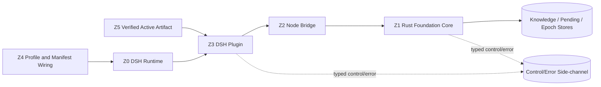

# dsh-memory 架构分区

状态：design；source bindings pending。

物理边界：本插件位于 `dsh-plugins/dsh-memory/`；所有实现 worktree 位于 `dsh-plugins/playground/`，禁止在插件子目录创建嵌套 Git 仓库。

## 1. 分区



## 2. Z0：DSH Runtime

DSH owner：Agent Loop、Session Journal、Surface、tool pairing、provider request、PromptContext lifecycle。

dsh-memory 不复制、不反向重建这些 truth。只有 source pin 证明不存在插件 seam 时，才提交 Core 修改决策。

## 3. Z1：Foundation Core

目标 artifact：`dsh-memory-core`。

唯一业务 owner：

- Memory entry contracts and validation。
- Eligible source-window policy。
- Pending Index and generation freeze。
- Revision/Evidence ledger。
- Organization Delta validation。
- Oldest-10% deterministic selection。
- Segment coverage/tag-union validation。
- Index Epoch build/promotion/recovery。
- Recall query and history/evidence projection。

Core 不知道 DSH profile、Cordis、provider、PromptContext row ID 或 UI。

核心语义默认 Rust 实现。原因：关键流水线、contract parser、semantic gate、error policy 和持久化事务必须只有一个强类型 owner。

## 4. Z2：Node Bridge

目标：薄 N-API bridge；exact packaging 在 DSH source pin 后确认。

允许：

- TypeScript DTO 与 Rust contract 的一对一传输。
- async call、cancellation 和 typed error transport。
- artifact loading and version compatibility check。

禁止：

- 复制 validator、dedupe、selector、organization、epoch、recovery 逻辑。
- silent coercion、unknown-field strip、error-to-success conversion。
- 把 control 字段混进 Memory payload。

## 5. Z3：DSH Plugin

目标 artifact：`@jason/dsh-memory`。

责任：

- 注册 Cordis services/tools/commands/events。
- 捕获 tool-call 和 compaction-summary 的 `memory` 字段。
- 替换唯一 compaction provider。
- 调用 Core，投影 Frozen Index 到 PromptContext。
- 把 Recall Result 追加在请求尾部。
- 暴露 `memory_organize` 与 `/memory-organize`。

Plugin 只编排，不拥有长期记忆业务规则。

## 6. Z4：Profile 与 Manifest Wiring

责任：

- 从 DSH `dump-config` 读取真实 preset/realm/row IDs。
- 替换默认 compaction provider。
- 保留 compact command 与 tool-result pruner。
- 编译确定性 capability manifest。

Profile、row、provider selection、health 和 retry 都是 control resource，不进入 model Memory payload。

## 7. Z5：Active Artifact

Runtime 只消费：

```text
verified dsh-memory-core artifact
+ verified Node bridge
+ verified DSH plugin
+ compiled deterministic manifest
```

Playground、Protected source、generated authoring files不得成为 runtime discovery surface。

## 8. 允许边与禁止边

允许：

```text
DSH Runtime -> Plugin -> Bridge -> Core -> Stores
Core/Plugin -> typed Control/Error Side-channel
Core -> immutable Raw Knowledge + append-only Organization Delta
Plugin -> DSH PromptContext/Surface through verified public seams
```

禁止：

```text
Plugin -> direct Store mutation bypassing Core
Bridge -> duplicate semantic validation
Core -> DSH profile/provider access
Control/Error -> Memory payload
Index projection -> reconstruct Journal truth
Pending Index -> long-term Knowledge without compaction
Generated/Protected/Playground -> runtime scanning
```
