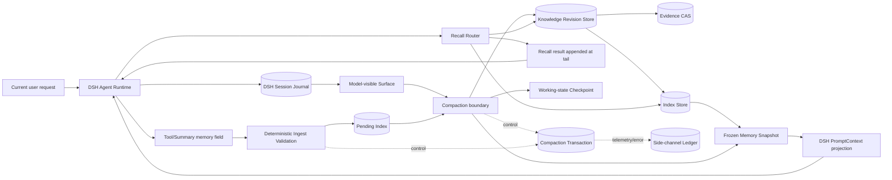

# dsh-memory 概要设计

状态：等待 Jason 批准

阶段：概要设计；禁止详细设计、实现、编译、review、发布

治理引擎：外部 AppSDK 0.1.6；项目内只保存项目契约和生命周期记录

## 1. 决策摘要

dsh-memory v1 采用 DSH 原生插件方案，不 fork DSH Core。插件接管长期知识、索引、召回和 cache-aware compaction 协调；DSH 继续拥有 Agent Runtime、Session Journal、Surface 和工具调用配对规则。

核心约束：

1. Session Journal 是“发生过什么”的不可变真源。
2. Surface 是模型可见投影，不反向成为历史真源。
3. Working State 保存当前目标、未证实假设、未解决错误和下一步；不自动升级为长期知识。
4. Knowledge Store 使用 append-only Revision Graph；纠正是新增 revision，不覆盖旧认知。
5. Tool-call、assistant end-turn 与 compaction-summary 都被严格提示要求提供 schema-versioned `memory` 字段；Host 永不因缺失或坏 schema 拒绝 parent output，可识别且局部有效的 entries 进入 Pending Index。
6. 普通 Recall 只追加到请求尾部，不修改稳定 system/tools 前缀。
7. Pending Index 未经过成功 Compaction 不得进入长期知识；Compaction 同时提交原始条目与整理增量。
8. 控制状态、provider/model、锁、retry、epoch hash、metrics、debug、错误链全部走 side-channel，不混入业务消息或 Memory 内容。
9. 未解决错误必须留在 Surface；仅在结果和教训被 checkpoint 或 knowledge 吸收后，下一次 compaction 才遮蔽过程。
10. Index 达到上限后，由 Compaction 确定性选择最古老 10% 做二次压缩；手工整理命令复用同一 transaction owner。

## 2. 目标与非目标

目标：在不破坏 DSH KV Cache 稳定前缀的前提下，为跨 Session 工作提供可审计、可纠正、按需召回的长期记忆。

V1 验收口径：

- 同一 Memory Snapshot 内 system/tools hash 不变。
- 普通 memory write 不改变下一轮稳定前缀。
- Recall 结果仅追加尾部；无命中时不注入伪内容。
- Knowledge revision、evidence、supersedes/contradicts/retract 关系可回查。
- 未解决探索不会被提前从 Surface 遮蔽。
- compaction 中断后可确定恢复；不得出现“Surface 已切换但 Index 未知”或反向不一致。
- 所有被收集的 model-originated candidate 经 schema、evidence、scope、secret、injection、dedupe、conflict 局部验证。
- `memory` 字段缺失、schema 错误、引用未知 entry、伪造当前工具成功结果时不拒绝 parent output；无效部分不入 Pending Index，原始输出保留并记录诊断。
- 未 compact 的条目只存在 Pending Index；成功 compact 后，原始条目与整理增量均可回查。
- 增量整理只处理 watermark 后的新条目；全量整理创建新 Organization Epoch，不覆盖旧 epoch。

非目标：DSH Core fork、首版管理 UI、compact 前写长期知识、每轮 subagent/embedding、把普通代码事实重复存入 Memory。

`memory` 字段、Pending Index、10% 压缩、整理增量与命令协议见 [Memory Index Protocol](./memory-index-protocol.md)。

本次规则修正：模型侧是强提示、Host 侧是软接收。tool-call、assistant end-turn、compaction summary 三类输出均可携带 memory；缺失或不合 schema 不阻断 parent output，只有可识别且局部有效的条目进入 Pending Index。手工、定时和 compaction 组织统一使用同一 transaction owner。存储支持独立 root、只读备份、格式版本和显式迁移流程。

## 3. 系统边界



禁止边：

- Journal 内容不得被 Memory Head 或 Surface 反向重建。
- Control Ledger 不得写入 user/assistant/tool payload、Memory body 或 Recall result。
- Index Snapshot 不得成为 Knowledge 真源。
- Extractor/Subagent 不得直接写 Knowledge Store。
- Runtime 不得扫描 `playground/`、`generated/` 或 Protected 源码拼装插件。

## 4. 资源与唯一 owner

| Resource | 类型 | 唯一 owner | 说明 |
|---|---|---|---|
| Session Journal | truth | DSH Session | 完整、不可变执行历史 |
| Model Surface | projection | DSH Session Surface | 可验证连续 replace；不是 truth |
| Working-state Checkpoint | business projection | memory-compaction | 当前任务继续工作所需状态 |
| Memory Emission | business payload | response-protocol | tool/summary 输出中的 index-ready 字段 |
| Pending Index | durable staging truth | memory-index | 立即接收已验证 emission；compact 前不是长期知识 |
| Knowledge Revision Store | truth | memory-store | revision/head/关系/状态 |
| Evidence CAS | truth | memory-store | 被接受知识的不可变证据片段 |
| Search Index | derived projection | memory-index | tag/BM25/segment 引用，可重建 |
| Organization Delta | append-only knowledge delta | memory-organizer | category/placement/aggregate；必须完整引用输入 cut |
| Organization Epoch | projection generation | memory-index | 每次增量或全量整理生成新 epoch，不覆盖旧 epoch |
| Frozen Memory Snapshot | model projection | memory-context | Session/Compaction 边界生成 |
| Recall Result | ephemeral business payload | memory-recall | 当前请求尾部的少量结果 |
| Compaction Transaction | control | memory-compaction | prepare/commit/recover/idempotency |
| Telemetry/Error Ledger | debug/control | memory-observability | cache、延迟、错误链；模型不可见 |

## 5. 逻辑模块

概要阶段保留一个发布模块 `dsh-memory`，内部边界先作为设计 component；详细设计证明独立 owner、调用方和验证收益后才拆包。

| Component | 责任 | 允许依赖 | 禁止责任 |
|---|---|---|---|
| contracts | Revision、MemoryEmission、Evidence、Index、OrganizationDelta、Recall schema | 无业务实现 | 存储、模型调用 |
| memory-store | revision/head/evidence 事务与查询 | contracts | prompt 注入、provider 选择 |
| memory-index | 倒排/BM25、segment、snapshot 构建 | store read API | 修改 Knowledge truth |
| memory-recall | exact/BM25/segment-expand/rerank 路由 | index、store read API | 每次强制 subagent；直接写记忆 |
| memory-ingest | emission schema、来源窗口、安全、去重、scope 验证；追加 Pending Index | index、contracts | compact 前写长期知识；模型自行裁决 |
| memory-organizer | 增量/全量归类、10% segment 压缩、完整引用验证 | index、store、contracts | 删除原始条目；覆盖旧 epoch |
| memory-context | 静态 policy 与 frozen snapshot 的 DSH 投影 | index snapshot read API | 动态改 system prompt |
| memory-compaction | working-state、吸收判定、transaction、snapshot 切换协调 | admission、index、DSH compaction seam | 重写 Journal；泄漏控制字段 |
| dsh-integration | Cordis services/tools/events/profile wiring；tool/summary memory 字段采集 | 上述公开 API | 重复业务逻辑；修改 provider payload 语义 |
| observability | cache/recall/compaction/recovery evidence | typed side-channel | 进入业务 payload |

## 6. 三条主线

### 6.1 Recall 主线

```text
Current request
  -> deterministic query normalization
  -> exact tag/entity lookup
  -> BM25 lookup
  -> segment expansion when needed
  -> optional small-model rerank only for ambiguous candidates
  -> memory_get current revision
  -> append bounded Recall Result at request tail
```

默认只返回 current active revision；显式 history/evidence 工具才展开旧 revision 与证据。

### 6.2 Memory emission 与 Pending Index 主线

```text
Completed prior-turn range or compacted summary range
  -> model is instructed to emit memory.entries[] (optional in acceptance)
  -> host observes tool-call/end-turn/summary and attaches immutable source-event references
  -> best-effort schema/source-window validation without rejecting parent output
  -> secret and prompt-injection validation
  -> duplicate/conflict/scope validation
  -> append PendingIndexEntry
  -> keep entry in recent tail and external search
  -> do not write long-term knowledge before compaction
```

工具调用时只能记忆当前工具执行前已完成的内容，不能把当前尚未返回的工具写成成功。未验证猜测只进 Working State。Procedure 必须绑定历史中的成功结果。User preference 必须绑定用户明确表达。

### 6.3 Compaction 主线

```text
DSH selects safe contiguous range
  -> freeze Pending Index generation at watermark
  -> build Working-state Checkpoint
  -> summary model emits memory.entries + organized_index delta
  -> persist immutable raw entries into long-term revision/evidence ledger
  -> organize the entire frozen pending generation
  -> if capacity reached, separately select oldest 10% of projected active index
  -> validate full organization coverage, 10% compression coverage, entry refs, tag union, and compressed segments
  -> append Organization Delta and build next categorized index epoch
  -> DSH performs validated Surface replacement
  -> commit/promote exact index epoch
  -> emit compaction/end evidence
  -> recover or fail closed after interruption
```

精确 prepare/replace/commit 顺序仍是详细设计阻塞项：必须先读取并验证指定 DSH commit 的 CompactionEngine、Session Surface 与 event ordering，不能根据旧调查猜测原子能力。

## 7. 状态模型

Pending Index Entry：

```text
emitted -> validated -> pending -> frozen-in-compaction
                  \-> rejected
frozen-in-compaction -> raw-committed + organized
```

Exploration Unit：

```text
unresolved -> resolved -> absorbed
          \-> abandoned
```

只有 `absorbed` 可在后续 compaction 中从 Surface 投影遮蔽。任何状态变化不删除 Journal 事件。

Index 生命周期：

```text
L0 pending entries -> L1 organized epoch -> L2 compressed segments
                                      \-> current Session PromptContext
```

描述可压缩；child refs、canonical tags、memory IDs、revision/evidence lineage 不得丢失。所有 tags 留在外部索引；模型只见目录和 hot entries。

## 8. Cache 不变量

请求布局：

```text
[Static System Policy]
[Static Tool Schemas]
[Compacted Working State]
[Frozen Memory Snapshot]
[Recent Conversation Tail]
[Current Recall Result]
[Current User Message]
```

不变量：

- static policy/tools 在 Session 内不变。
- Pending Index append 不立即改变当前 frozen snapshot；emission 已作为正常历史尾部存在。
- snapshot 只在 Session 创建或成功 compaction 边界切换。
- Recall 只追加尾部。
- cache telemetry 记录 logical input 与 actual prefilling，不能只看 token 总量推断命中。

## 9. 里程碑与 Gate

| Milestone | 范围 | 必须证据 |
|---|---|---|
| M0 Source Pin + Cache Baseline | 固定 DSH/Cairn commit、API seam、license；建立缓存基线 | system/tools hash、cached input、prefill、replace generation |
| M1 Memory Emission + Pending Index | tool/summary `memory` schema、ingest validator、durable pending index | 缺字段/坏 schema/当前工具伪成功必须红；正常 emission 直接入 pending |
| M2 Read-only Recall | search/get/history/evidence、pending + committed 查询、frozen snapshot | current/history 正反测试；pending append 不破坏 snapshot |
| M3 Cache-aware Compaction + Organize | 原始提交、整理增量、10% 压缩、增量/全量命令、transaction/recovery | coverage/refs/tag union；success/failure/still-running/already-terminal；中断恢复 |
| M4 Multi-level Index | L0/L1/L2、child refs、多级召回、epoch history | 压缩前后 recall 等价；raw/organization lineage 不丢 |
| M5 Automation + UI | policy automation、version/conflict UI、metrics | false recall、rollback、权限与 deployed blackbox |

Review 顺序固定：实现完成 → 模块边界自检 → 定向测试 → 构建 → 安装/重启 → DSH 用户入口真实样本 → review admission → 指定 reviewer PASS。review 后改代码则全部相关证据失效。

## 10. 概要批准后才执行的详细设计

1. 重新调查并固定 DSH/Cairn exact commit、接口、realm、profile row id、license。
2. 产出 machine-readable resource map、function map、mainline call map、module registry、verification map；所有实现 symbol 在源码存在前标 `binding pending`，不得伪造。
3. 定义 Revision/Evidence/Candidate/Index/Recall/Control/Error 类型与序列化 schema。
4. 证明 compaction transaction 与 Surface replace 的唯一合法顺序、崩溃点和恢复矩阵。
5. 定义存储引擎选择、事务/锁/idempotency、CAS 保留和迁移策略。
6. 定义 DSH plugin wiring、PromptSection/PromptContext 内容、tools 与 subagent allowlist。
7. 写测试设计：生命周期、白盒、模块黑盒、部署黑盒、cache benchmark、正反红测。
8. 初始化 Git 与 clean Playground worktree；goal 未确认前不进入该步骤。

## 11. 批准门

批准内容：目标、十条核心约束、`memory` 输出协议、Pending/Long-term 边界、10% 压缩、原始+整理增量、增量/全量命令、资源边界、单发布模块策略、M0→M5 顺序。

批准不等于授权实现、发布、迁移或删除。批准后只进入详细设计与 DSH/Cairn source pin 调查；详细设计再次提交批准后才实现。
