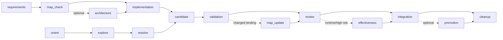

# agent-plugins Guidance

The repository root is the shared Guidance surface for four first-party
projects. The root layer records context and recommends the next safe action;
each child project retains its own AppSDK lifecycle truth.

## Project bindings

| project | root status | source / governance truth | owner |
| --- | --- | --- | --- |
| agent-tui | active | `agent-tui/.appsdk/` | `agent-tui` |
| agent-memory | pending | source is not on current `origin/main` | `agent-memory` |
| Teams | active | `Teams/.appsdk/` | `teams-design` |
| dsh-concurrency-limit | active source binding; local governance pending | `dsh-concurrency-limit/` | `dsh-concurrency-limit` |

`deepseek-harness` and an optional ignored `opencode/` checkout are external
read-only references. Root Guidance never copies their source, maps, or
records.

## Feature lifecycle

The mandatory feature spine is `requirements → map_check → implementation →
candidate → validation → review → integration → cleanup`. `architecture` may
be bypassed after `map_check` when existing design covers the change;
`map_update` is used only when feature/owner/path/gate bindings change;
`effectiveness` is selected for runtime or higher-risk work; and `promotion` is
selected only when immutable Active/Protected delivery is required. Every
bypass is recorded as a one-line decision.

Debug always uses the mandatory chain `orient → explore → resolve → candidate →
validation → review → integration → cleanup`. `orient` binds the issue to the
actual resource/function/mainline/module/verification context, `explore` records
reproduction and causal notes, and `resolve` changes the unique owner and
updates maps/gates when the verified contract changes.

## AppSDK domain surfaces

The machine Guidance also exposes the complete AppSDK domain surface. A task
selects only the applicable domain; this list does not make optional delivery
steps mandatory for every small change.

| domain | sequence |
| --- | --- |
| bootstrap | `prepare → initialize → baseline_verify` |
| migration | `inspect_legacy → choose_route → apply_route → migration_verify` |
| governance-preflight | `goal_scope → architecture_maps → owner_worktree → preflight_verify` |
| review | `review_admission → architecture_review → unchanged_effectiveness` |
| delivery | `whitebox → build → install → restart → blackbox → bind_validation` |
| integration | `refresh_main → integration_verify → merge_push → remote_receipt` |
| promotion | `regression → compile → publish` |
| freeze | `archive → freeze_record → freeze_verify` |
| cleanup | `cleanup_record → remove_worktree → release_claim` |

The extracted cross-project rules are: use only declared sources; prefer
adjacent transitions; bind evidence to each passing required step; revise on
context drift; keep plans, events, records, and history append-only; do not
claim lifecycle completion early; bind work to maps and gates; keep debug
exploration notes; update changed map/gate bindings; keep control truth out of
business payloads and metadata; use one owner; perform ablation and prefer
configuration-first operations; review new code against those boundaries; use
requirements/architecture/design in proportion to risk; and inspect prior
records before retrying.

## Operating checklist

1. Read root and child context plus current run notes.
2. For a feature, record requirements and then read the actual resource map,
   function map, mainline call map, module registry, and verification map;
   for a debug task, perform that binding in `orient` before `explore`.
   Record a missing map as a gap rather than guessing.
3. Work in one clean owner worktree from current `origin/main`.
4. Keep control side-channel data out of business payloads.
5. Select focused tests and real entrypoint checks by risk.
6. Before closeout, review `AGENTS.md`, local Skills, and `MEMORY.md`; clean
   only the owner's merged, clean worktree after its required receipt.
