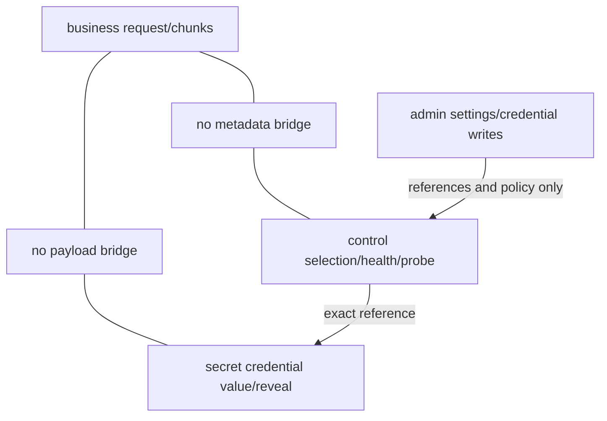

# DSH Multi-Key Provider Review Surface

Canonical plan: [plan](../goals/dsh-multikey-provider-plan.md)

Detailed design: [design](../../outputs/dsh-multikey-provider-detailed-design.md)

Machine manifests: [composition](../architecture/composition-manifest.json),
[resources](../architecture/resource-registry.json),
[functions](../architecture/function-map.json),
[mainline](../architecture/mainline-call-map.json),
[verification](../architecture/verification-map.json), and
[lifecycle](../architecture/lifecycle.json).

## Ownership

| Resource | Installed owner | Plugin action |
|---|---|---|
| Official Provider routes | `@deepseek-ai/dsh-llm-pi-ai` | none |
| `llm-pi-ai` namespace | official Provider | none |
| Pool routes | `dsh-multikey-provider` | register configured new routes |
| `multikey-provider` namespace | plugin host | validate and store pool profiles |
| Models section | plugin client while installed | replace client entry via exact patch |
| Credentials | DSH credentials service | resolve/write by reference only |

## Mainline

```mermaid
flowchart LR
  A[ComposeIn01KeepOfficialProvider] --> B[ComposeIn02ReplaceModelsClient]
  B --> C[ComposeIn03MountHost]
  C --> D[ConfigIn01CompileProfiles]
  D --> E[BackendIn01CaptureOfficial]
  E --> F[RegisterIn01OwnPoolRoutes]
  F --> G[RequestIn01SelectKey]
  G --> H[RequestIn02ResolveCredential]
  H --> I[RequestIn03OfficialBackend]
  I --> J[ResponseOut01CommitOrAdvance]
```

## Plane Separation

## Install Checklist

- Official `llm-pi-ai` entry active and absent from plugin patch.
- Official Models client exact-name disabled; package remains installed.
- `multikey-provider` entry active.
- Official routes retain one official owner.
- Every pool route has one plugin owner and no collision.
- Namespaces `llm-pi-ai` and `multikey-provider` have distinct owners.
- One Models section owner.
- Browser and live catalog/custom tests pass.

## Restore Checklist

- Remove plugin bundle and restart DSH.
- Plugin entry, routes, namespace, RPCs, and client bundle absent.
- Official Provider and Models entries active.
- Official Provider/model call and official Models edit pass.

Hot reload is not restore evidence.
