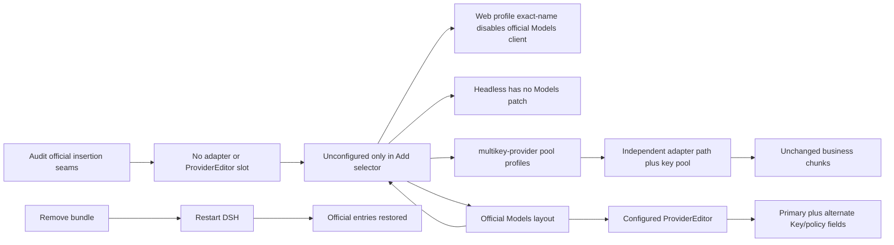

# DSH Multi-Key Provider Review Surface

Status: active

- [Plan](../goals/dsh-multikey-provider-plan.md)
- [UI states](../ui/README.md)
- [UI states (interactive)](../ui/multikey-ui-states.html)
- [UI states (desktop)](../ui/multikey-ui-states.desktop.png)
- [UI states (mobile)](../ui/multikey-ui-states.mobile.png)
- [UI states (dark)](../ui/multikey-ui-states.dark.png)
- [UI render manifest](../ui/render-manifest.json)
- [Architecture implementation design](../architecture/implementation-architecture.md)
- [Detailed design](../architecture/detailed-design.md)
- [Detailed design](../../outputs/dsh-multikey-provider-detailed-design.md)
- [Composition owner diagram](../diagrams/composition-owner.png)
- [Module ownership diagram](../diagrams/module-ownership.png)
- [Request mainline diagram](../diagrams/request-mainline.png)
- [Attempt state machine diagram](../diagrams/attempt-state-machine.png)
- [Key health state diagram](../diagrams/key-health-state.png)
- [Restore sequence diagram](../diagrams/restore-sequence.png)
- [Diagram source and render manifest](../diagrams/README.md)
- [Diagram render manifest](../diagrams/render-manifest.json)
- [Composition](../architecture/composition-manifest.json)
- [Resources](../architecture/resource-registry.json)
- [Modules](../architecture/module-registry.json)
- [Functions](../architecture/function-map.json)
- [Mainline](../architecture/mainline-call-map.json)
- [Lifecycle](../architecture/lifecycle.json)
- [Tests](../architecture/test-design.md)
- [Verification](../architecture/verification-map.json)
- [Official delta](../architecture/upstream-delta.json)
- [Upstream](../../UPSTREAM.md)

## Approval Checklist

- Additive insertion is the selected composition.
- Official Provider stays active and unchanged.
- Official Models package remains installed; only its client entry is disabled.
- Patch names equal official target package names.
- Plugin owns only pool routes and the `multikey-provider` namespace.
- Models section is registered once by the plugin client.
- No second config, route, Models page, Plugins editor, or `llm/stream` hook.
- Official UI structure and CSS remain; only the existing provider editor grows.
- Unconfigured providers expose no pool UI and remain only in Add provider.
- Control and credential state never enters business payload.
- Removal plus restart restores official owners and original behavior.
