# Multi-Key Pi-AI Replacement Review Surface

Status: design pending approval

Canonical design: [goal plan](../goals/dsh-multikey-provider-plan.md)

Detailed design: [detailed design](../../outputs/dsh-multikey-provider-detailed-design.md)

Machine lifecycle: [lifecycle](../architecture/lifecycle.json)

Composition: [composition manifest](../architecture/composition-manifest.json)

Boundaries: [resource registry](../architecture/resource-registry.json), [module registry](../architecture/module-registry.json)

Code bindings: [function map](../architecture/function-map.json), [mainline call map](../architecture/mainline-call-map.json)

Evidence: [test design](../architecture/test-design.md), [verification map](../architecture/verification-map.json)

Upstream baseline: [public entrypoint provenance](../../UPSTREAM.md)

Install fixture: [installed profile dump-config](../architecture/fixtures/installed-profile.dump-config.json)

Restore fixture: [restored profile dump-config](../architecture/fixtures/restored-profile.dump-config.json)

Authoring path: `dsh-multikey-provider/`; target runtime package identity:
`dsh-llm-pi-ai-multikey`. The module registry owns the one-time physical
replacement inventory.

```mermaid
flowchart LR
  Base[official base/web bundles] --> Disable[exact-name disable official provider + Models]
  Disable --> Insert[insert llm-pi-ai-multikey]
  Insert --> Apply[replacement host facade + official public adapter/config]
  Insert --> Models[public-wire Models section + alternate-key controls]
  Apply --> Profiles[official-compatible profiles]
  Profiles --> Pool[key pool descriptors]
  Request[GenerateOptions] --> Snapshot[immutable provider snapshot]
  Pool --> Select[key selection + health]
  Snapshot --> Select
  Select --> Credential[credential resolve]
  Credential --> Wire[pi-ai outbound attempt]
  Wire --> Commit{business output started?}
  Commit -->|no + key-specific error| Select
  Commit -->|yes or final| Response[unchanged StreamChunk output]
  Models --> Control[loopback probe + pool mutations]
  Control --> Select
  Select --> Health[redacted health view]
  Remove[remove replacement bundle] --> Restart[restart DSH]
  Restart --> Official[official provider + Models owners]
  Official --> Replay[original provider/model/settings replay]
```

## Approval Checklist

- Official provider and Models packages stay installed; their exact existing
  entries are disabled and the independent replacement entry is inserted.
- Patch `name` values equal target package names; no design treats them as
  replacement values.
- The replacement owns the same existing routes and registers no new route.
- `apiKeyEnv` remains the official Models page's primary key; `apiKeyPool`
  contains alternates only.
- Key advance is limited to credential/account errors before business output.
- Harness retry remains the only request-level retry owner.
- Control/secret resources do not enter request, response, metadata, session, or
  logs.
- The replacement client owns the original Models section and all alternate-key
  add/rotate/status/explicit-reveal/copy-value/copy-ref/enable/probe controls;
  stored values travel only on the loopback secret side-channel and transient
  component state, never through settings, business payloads, or shared stores.
- Install and restore fixtures require exactly one owner each for retained
  provider routes, the `llm-pi-ai` namespace, and `settings.section:models`.
- Removing the bundle plus restarting DSH restores official provider and Models
  owners; hot reload alone is not approval evidence.
- Install and restore gates prove dump-config, route owner, namespace owner,
  Models owner, client boot graph, real provider call, and settings operation.
- Registry status remains `design` until real symbols and gates are implemented.
- Repository CI runs the design gate; active prebuild stays red until the old
  implementation is physically replaced, package identity changes, and every
  resulting source file has one owner.
